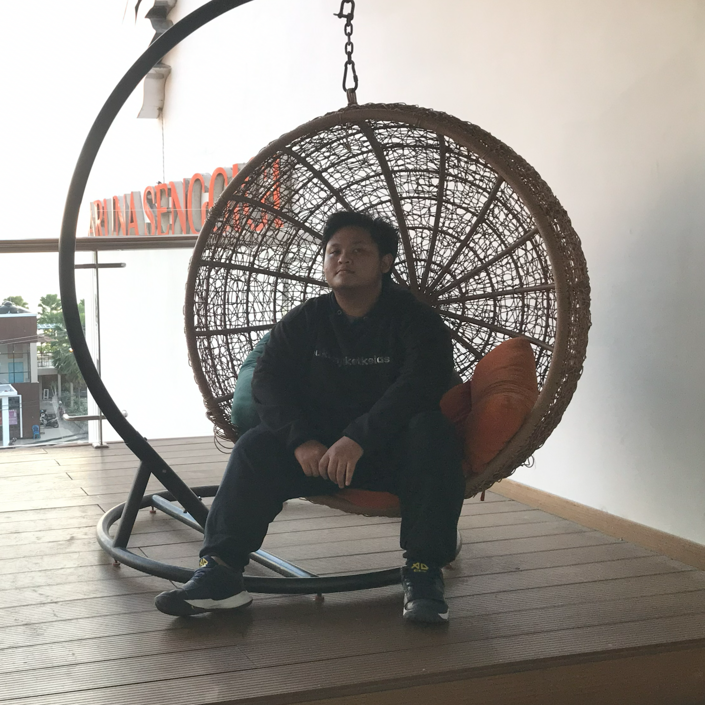

# About Us

Welcome to our project! We are a passionate team of individuals dedicated to creating innovative solutions for our users. Our mission is to make life easier and more efficient through technology.

## Development Team

Meet the talented individuals behind this project:

### Mahendra Puta Raharja

- **Role**: Project Manager
- **Bio**: Mahendra is an experienced project manager with a track record of successfully delivering complex projects on time and within budget. He is a visionary leader with a passion for technology and a strong commitment to customer satisfaction.
- **GitHub**: [Mahen's GitHub Profile](https://github.com/OmMahen)
- **LinkedIn**: [Mahen's LinkedIn Profile](https://www.linkedin.com/in/mahendra-putra-raharja/)

### Diaz Khalid Ananda

- **Role**: Developer
- **Bio**: Diaz is a passionate Informatics Engineering student at the University of Mataram. He has a keen interest in website development. Despite his limited experience, he remains dedicated to continuous learning and strives to expand his knowledge.
- **GitHub**: [Diaz's GitHub Profile](https://github.com/diazkhalid)
- **LinkedIn**: [Diaz's LinkedIn Profile](https://www.linkedin.com/in/diaz-khalid-ananda-5a135a267/)

We are a diverse and dedicated team, working collaboratively to bring you the best possible solutions. Thank you for being a part of our journey!
